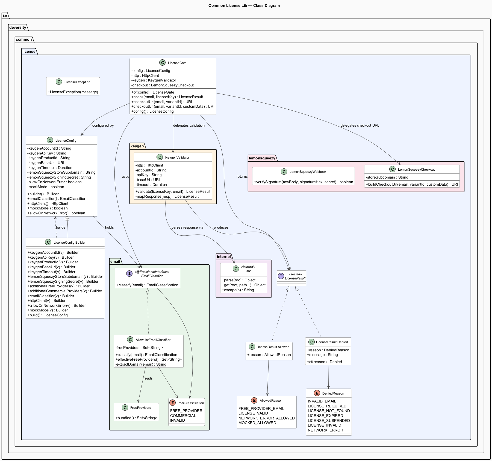
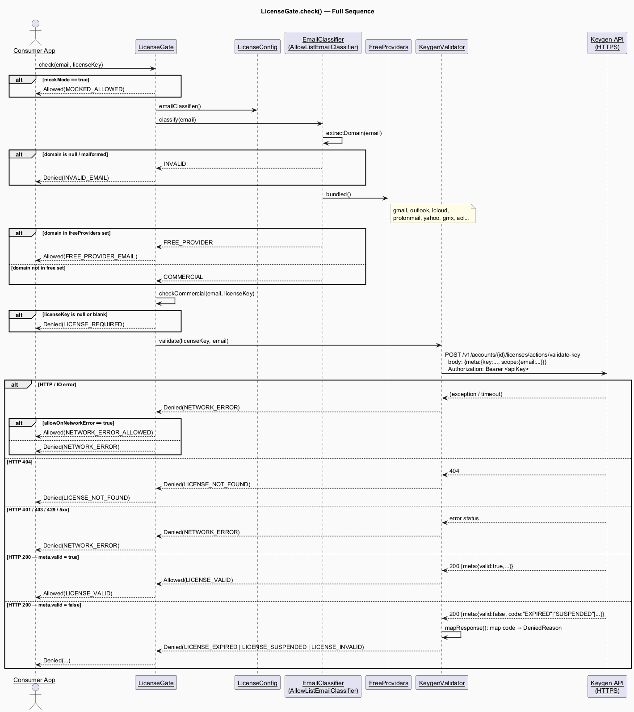
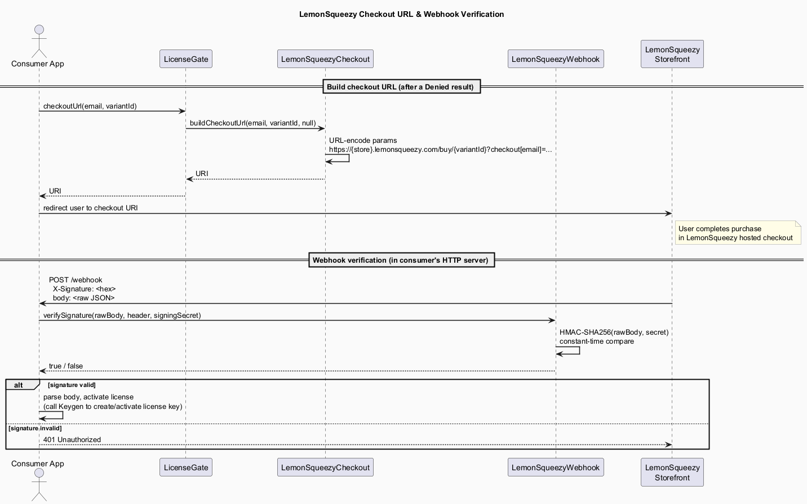

# Architecture

`common-license-lib` is a zero-dependency JVM library (Java 21) that enforces PolyForm Commercial-style licensing: free for personal/hobbyist email addresses, paid (Keygen.sh license key required) for commercial ones. It integrates with [Keygen.sh](https://keygen.sh) for license validation and [LemonSqueezy](https://www.lemonsqueezy.com/) for checkout URL generation and webhook verification.

---

## Package Overview

| Package | Role |
|---|---|
| `license/` | Public API — `LicenseGate`, `LicenseConfig`, `LicenseResult`, `LicenseException` |
| `license/email/` | Email classification interface and default allow-list implementation |
| `license/keygen/` | HTTP client wrapper for Keygen's `validate-key` REST endpoint |
| `license/lemonsqueezy/` | Checkout URL builder and webhook HMAC-SHA256 verifier |
| `license/internal/` | Purpose-built minimal JSON parser — **not public API** |

There are no singletons, no DI framework, no reflection, and no third-party runtime dependencies. Every consumer supplies its own `LicenseConfig`, so multiple `LicenseGate` instances can coexist in the same JVM against different Keygen accounts.

---

## Class Diagram



### Key design decisions

**`LicenseResult` is a sealed interface** with two record subtypes (`Allowed` and `Denied`). Consumers are expected to switch exhaustively over the two shapes. `AllowedReason` and `DeniedReason` enums give machine-readable granularity without throwing exceptions on the hot path.

**`LicenseConfig` is an immutable value object** built via a fluent builder. It holds all credentials, timeout, and behavioural flags (`allowOnNetworkError`, `mockMode`). `toString()` redacts secret fields. The builder validates that Keygen credentials are present unless `mockMode` is set.

**`EmailClassifier` is a `@FunctionalInterface`** so consumers can replace the entire classification logic with a lambda. The default implementation (`AllowListEmailClassifier`) unions the bundled free-provider list with `additionalFreeProviders` and then subtracts `additionalCommercialProviders` (commercial overrides always win). Domain normalisation uses lowercase + IDN punycode so international domains work correctly.

**`LemonSqueezyCheckout` and `LemonSqueezyWebhook`** are standalone stateless helpers. Neither requires a `LicenseGate` instance — a consumer server verifying webhooks does not need Keygen credentials in scope.

**`Json` (internal)** is a hand-rolled recursive-descent parser that reads only the handful of fields the Keygen response uses (`meta.valid`, `meta.code`). It avoids pulling in Jackson or Gson.

---

## Sequence: `LicenseGate.check()`

This is the main hot path called on every app launch / API call to decide whether the current user is permitted to run the software.



### Decision tree (text summary)

```
check(email, licenseKey)
 ├─ mockMode=true  → Allowed(MOCKED_ALLOWED)                    [test shortcut]
 ├─ classify(email)
 │   ├─ INVALID       → Denied(INVALID_EMAIL)
 │   ├─ FREE_PROVIDER → Allowed(FREE_PROVIDER_EMAIL)             [no network call]
 │   └─ COMMERCIAL
 │       ├─ key blank → Denied(LICENSE_REQUIRED)                 [no network call]
 │       └─ POST Keygen validate-key
 │           ├─ IO / timeout → Denied(NETWORK_ERROR)
 │           │   └─ allowOnNetworkError=true → Allowed(NETWORK_ERROR_ALLOWED)
 │           ├─ HTTP 404     → Denied(LICENSE_NOT_FOUND)
 │           ├─ HTTP 4xx/5xx → Denied(NETWORK_ERROR)
 │           ├─ meta.valid=true  → Allowed(LICENSE_VALID)
 │           └─ meta.valid=false → Denied(LICENSE_EXPIRED | SUSPENDED | INVALID …)
```

**Fail-closed by default.** Any network error produces `Denied(NETWORK_ERROR)` unless the consumer explicitly opts in via `LicenseConfig.Builder#allowOnNetworkError(true)`.

**`KeygenValidator.mapResponse()`** treats HTTP 200 with `meta.valid=false` as a normal denial (not an error), because Keygen returns 200 for expired/suspended keys and puts the outcome in the JSON body. HTTP 401/403 (bad API token) and 5xx surface as `NETWORK_ERROR` to avoid accidentally granting access due to misconfigured credentials.

---

## Sequence: Checkout URL & Webhook Verification

These are the LemonSqueezy integration paths, used after a `Denied` result to drive the user to purchase, and server-side to activate a license after payment.



### Checkout URL

`LicenseGate.checkoutUrl(email, variantId)` delegates to `LemonSqueezyCheckout.buildCheckoutUrl()`, which performs pure URL construction — no HTTP call. The resulting URI pre-fills the buyer's email in LemonSqueezy's hosted checkout page using the `checkout[email]` query parameter. Optional `customData` entries are encoded as `checkout[custom][key]=value` fields that LemonSqueezy passes through to your webhook payload.

### Webhook Verification

After a successful purchase, LemonSqueezy POSTs to your server with an `X-Signature` header containing the HMAC-SHA256 hex digest of the raw body, keyed with your store's signing secret.

`LemonSqueezyWebhook.verifySignature(rawBody, headerValue, signingSecret)` recomputes the HMAC and compares using `MessageDigest.isEqual()` (constant-time, safe against timing attacks). **The raw bytes must be passed — do not re-serialize from a parsed JSON object**, as whitespace differences will break the signature.

---

## Threading Model

`LicenseGate` is thread-safe. It holds:
- An immutable `LicenseConfig`
- A `java.net.http.HttpClient` (which is itself thread-safe and manages its own connection pool)
- A `KeygenValidator` (stateless beyond its constructor arguments)
- A `LemonSqueezyCheckout` (stateless URL builder)

The recommended pattern is to instantiate one `LicenseGate` at application startup and reuse it for the lifetime of the process.

---

## Testing Approach

| Technique | Where |
|---|---|
| `LicenseConfig.mockMode(true)` | Unit tests that must not hit the network — gate always returns `Allowed(MOCKED_ALLOWED)` |
| Injected `HttpClient` via `LicenseConfig.Builder#httpClient(mock)` | `KeygenValidatorTest` — feeds canned HTTP responses |
| `AllowListEmailClassifierTest` | Exercises domain normalisation, IDN, and list overrides in isolation |
| `consumer-fixture/` (separate Maven project) | Smoke-tests the library from the outside as a consumer dependency would see it |

---

## Publishing

Coordinates: `se.deversity.common:common-license-lib`. Version is managed in `gradle.properties`. The primary build is Gradle; a `pom.xml` is maintained in parallel for Maven-native consumers. Publishing to Maven Central uses the `com.vanniktech.maven.publish` plugin with in-memory GPG signing (`signingInMemoryKey` Gradle property).
